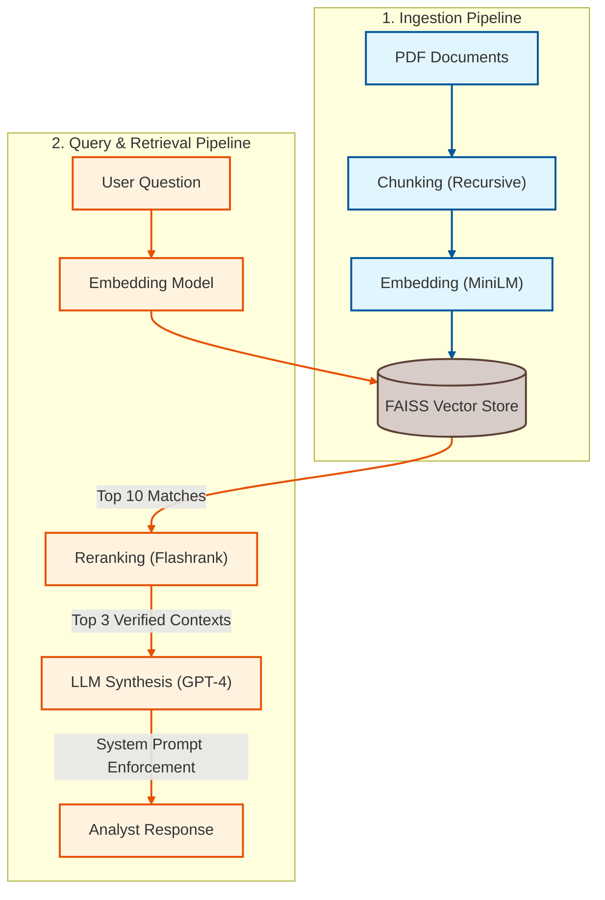

# Rag-Risk-Analyst: Institutional RAG System

## Project Overview
Rag-Risk-Analyst is a specialized Retrieval-Augmented Generation (RAG) chatbot designed for the **Credit & Risk Domain**. It ingests high-density financial filings (SEC 10-Ks), indexes them locally, and performs precision-based retrieval to answer questions about corporate debt, liquidity, and risk factors.

## Architecture Flow

## Architecture: MVP vs. Real-Time Production

This repository implements an **MVP (Minimum Viable Product)** using lightweight tools. However, the architecture is designed to be swappable for a high-frequency, real-time production environment.

### **1. Vector Database (The Memory)**
* **Current (MVP):** `FAISS` (Local CPU)
    * *Why:* Zero latency, no network calls, perfect for static datasets (Annual Reports).
* **Real-Time Alternative:** `Pinecone` or `Milvus` (Distributed)
    * *Scenario:* If we needed to index **Live Bloomberg News feeds**. These DBs support "Upserting" (inserting new data) while simultaneously querying, which local FAISS cannot handle efficiently at scale.

### **2. Ingestion Pipeline (The Data Feed)**
* **Current (MVP):** `PyPDFLoader` (Batch Script)
    * *Why:* We load documents once manually.
* **Real-Time Alternative:** `Apache Kafka` + `Spark Streaming`
    * *Scenario:* A "News Event" pipeline.
    * *Flow:* News hits Bloomberg API -> Kafka Topic -> Spark (cleaning) -> Vector DB (Pinecone). This ensures the RAG knows about a "CEO firing" within milliseconds of it happening.

### **3. Orchestration & Serving (The Brain)**
* **Current (MVP):** `LangChain` + `Standard REST API`
    * *Why:* Easy to debug and standard for Request/Response.
* **Real-Time Alternative:** `Ray Serve` + `WebSockets`
    * *Scenario:* Instead of waiting 10 seconds for a full answer, Ray Serve streams tokens (words) instantly via WebSockets to the trader's dashboard to minimize "Time to First Token" (TTFT).

### **4. Large Language Model**
* **Current (MVP):** `GPT-4` (External API)
* **Real-Time Alternative:** `Llama-3-70B` (Self-Hosted on vLLM)
    * *Scenario:* Financial data is sensitive. Big firms host models internally on GPU clusters (NVIDIA H100s) using vLLM engines to ensure data never leaves the firewall and to reduce latency.

